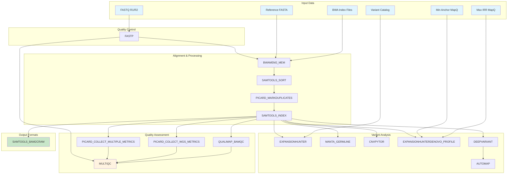

# nl-wgs_wf

[](https://www.nextflow.io/)
[](https://www.docker.com/)
[](https://opensource.org/licenses/MIT)

A comprehensive Nextflow pipeline for whole genome sequencing (WGS) analysis of germline short-read data. This pipeline is inspired by the [rare diseases pipeline from nf-core](https://nf-co.re/raredisease).

**Version**: 1.0.1  
**Last Updated**: January 2025

## 🎉 Version 1.0.1 Release

This release includes important fixes and improvements:

- ✅ **Fixed AutoMap parameter ordering** for proper execution
- ✅ **Added SAMtools container support** with dedicated Docker image
- ✅ **Increased Manta resources** to 32GB memory and 16 CPUs for better performance
- ✅ **Cleaned up output directory structure** by removing genome-specific subdirectories
- ✅ **Enhanced resource management** for improved pipeline stability

## 🎉 Version 1.0.0 Release

This is the first stable release of the nl-wgs_wf pipeline. Version 1.0.0 includes:

- ✅ **Complete WGS Analysis Pipeline**: End-to-end analysis from raw FASTQ to variant calls
- ✅ **Quality Control & Assessment**: Comprehensive QC with FASTP, MultiQC, Qualimap, and Picard
- ✅ **Variant Detection**: SNV/indels (DeepVariant), structural variants (Manta), CNVs (CNVpytor)
- ✅ **Repeat Analysis**: ExpansionHunter and ExpansionHunterDenovo for repeat expansion detection
- ✅ **Cloud Ready**: Full S3 support for input/output files
- ✅ **Containerized**: Docker support for all tools ensuring reproducibility
- ✅ **Production Ready**: Optimized for large-scale datasets with memory management

## Overview

This pipeline performs end-to-end analysis of whole genome sequencing data, including quality control, alignment, variant calling, structural variant detection, and repeat expansion analysis. It's designed for germline samples and supports both local and cloud execution.

## Features

- **Quality Control**: FASTP for adapter trimming and quality control
- **BWA-MEM2 Alignment**: Fast and accurate read alignment
- **BAM Processing**: Sorting, indexing, duplicate marking, and format conversion
- **Quality Assessment**: MultiQC report aggregation, Qualimap BAM QC, Picard metrics
- **Variant Calling**: SNV/indel detection with DeepVariant
- **Structural Variants**: Detection with Manta
- **Copy Number Variants**: Analysis with CNVpytor
- **Repeat Expansions**: Detection with ExpansionHunter and ExpansionHunterDenovo
- **Format Conversion**: BAM to CRAM conversion for storage efficiency
- **Container Support**: Docker/Singularity containers for reproducibility
- **Cloud Ready**: S3 support for input/output files

## Architecture



## Installation
- The pipeline is structured to run inside AWSHealthOmics, you just need to create a zip file with inside this repository and import it to create the pipeline. For the required parameters you can also import the `paramaters.json`, and we recommend to use `run_parameters.json` to import the input paths when running the pipeline (just remember to update the paths with your paths).
```bash
cd /path/to/nl-wgs_wf/
rm nl-wgs_wf.zip; zip -r nl-wgs_wf.zip * 
```

## Input Parameters

### Required Parameters

| Parameter | Description | Example |
|-----------|-------------|---------|
| `--fastq_r1` | Forward reads FASTQ file | `sample_R1.fastq.gz` |
| `--fastq_r2` | Reverse reads FASTQ file | `sample_R2.fastq.gz` |
| `--fasta` | Reference genome FASTA | `hg38.fa` |
| `--fai` | FASTA index file | `hg38.fa.fai` |
| `--sample_name` | Sample identifier | File basename |
| `--variant_catalog` | ExpansionHunter variant catalog | `null` |
| `--min_anchor_mapq` | Min anchor mapping quality | `null` |
| `--max_irr_mapq` | Max IRR mapping quality | `null` |
| `--outdir` | Output directory | `/mnt/workflow/pubdir` |

## Output Structure

```
outdir/
├── QC/                                    # Quality Control Reports
│   ├── *_fastp.html                      # FASTP HTML report
│   ├── *_fastp.json                      # FASTP JSON metrics
│   ├── *_multiqc_report.html             # MultiQC aggregated report
│   ├── *_multiqc_data/                   # MultiQC data files
│   ├── *.metrics                         # Picard multiple metrics
│   ├── *.wgs_metrics                     # Picard WGS metrics
│   └── *_bamqc/                          # Qualimap BAM QC results
├── ALIGNMENT/                            # Alignment Files
│   ├── *.cram                            # CRAM format files
│   ├── *.crai                            # CRAM index files
│   └── *.yml                             # Process version files
├── SNV/                                  # Single Nucleotide Variants
│   ├── *.deepvariant.vcf.gz              # DeepVariant VCF output
│   ├── *.deepvariant.vcf.gz.tbi          # VCF index files
│   ├── *.deepvariant.gvcf.gz             # DeepVariant gVCF output
│   ├── *.deepvariant.gvcf.gz.tbi         # gVCF index files
│   └── *.yml                             # Process version files
├── SV/                                   # Structural Variants
│   ├── *.candidate_small_indels.vcf.gz   # Manta small indel candidates
│   ├── *.candidate_small_indels.vcf.gz.tbi
│   ├── *.candidate_sv.vcf.gz             # Manta SV candidates
│   ├── *.candidate_sv.vcf.gz.tbi
│   ├── *.diploid_sv.vcf.gz               # Manta diploid SVs
│   ├── *.diploid_sv.vcf.gz.tbi
│   ├── *.pytor                           # CNVpytor data files
│   ├── *1000.vcf                         # CNVpytor VCF output
│   ├── *filtered.vcf                     # CNVpytor filtered VCF
│   ├── *manhattan_plot.png               # CNVpytor Manhattan plot
│   └── *.yml                             # Process version files
├── REPEATS/                              # Repeat Expansion Analysis
│   ├── *.vcf.gz                          # ExpansionHunter VCF
│   ├── *.json.gz                         # ExpansionHunter JSON
│   ├── *_realigned.bam                   # ExpansionHunter realigned BAM
│   ├── *.locus.tsv                       # ExpansionHunterDenovo locus data
│   ├── *.motif.tsv                       # ExpansionHunterDenovo motif data
│   ├── *.str_profile.json                # ExpansionHunterDenovo STR profile
│   └── *.yml                             # Process version files
└── ROH/                                  # Runs of Homozygosity
    ├── */*.HomRegions.tsv                # AutoMap homozygosity regions
    ├── */*.HomRegions.pdf                # AutoMap homozygosity plots
    └── *.yml                             # Process version files
```

## Processes

### Quality Control
- **FASTP**: Adapter trimming, quality filtering, and QC reports

### Core Alignment
- **BWAMEM2_MEM**: BWA-MEM2 alignment with read group information
- **SAMTOOLS_SORT**: BAM file sorting and indexing
- **PICARD_MARKDUPLICATES**: Duplicate marking and removal
- **SAMTOOLS_INDEX**: BAM indexing for downstream tools

### Quality Assessment
- **PICARD_COLLECT_MULTIPLE_METRICS**: Comprehensive BAM metrics collection
- **PICARD_COLLECT_WGS_METRICS**: Whole genome sequencing metrics
- **QUALIMAP_BAMQC**: BAM quality control analysis
- **MULTIQC**: QC report aggregation from all tools

### Variant Analysis
- **DEEPVARIANT_RUNDEEPVARIANT**: SNV/indel calling with DeepVariant
- **AUTOMAP**: Variant annotation and runs of homozygosity detection
- **MANTA_GERMLINE**: Structural variant detection
- **CNVPYTOR**: Copy number variant analysis
- **EXPANSIONHUNTER**: Repeat expansion detection
- **EXPANSIONHUNTERDENOVO_PROFILE**: De novo repeat detection

### Format Conversion
- **SAMTOOLS_BAM2CRAM**: BAM to CRAM conversion

## Configuration

### Docker Images

The pipeline uses the following Docker images (configure in `nextflow.config`):

- `fastp_docker`: FASTP quality control
- `bwa_docker`: BWA-MEM2 and Samtools
- `samtools_docker`: SAMtools for BAM/CRAM operations
- `picard_docker`: Picard tools
- `qualimap_docker`: Qualimap BAM QC
- `multiqc_docker`: MultiQC report generation
- `deepvariant_docker`: DeepVariant
- `automap_docker`: AutoMap variant annotation
- `manta_docker`: Manta
- `expansionhunter_docker`: ExpansionHunter
- `expansionhunterdenovo_docker`: ExpansionHunterDenovo
- `cnvpytor_docker`: CNVpytor

### Resource Requirements

| Process | Memory | CPUs |
|---------|--------|------|
| FASTP | 16 GB | 8 |
| BWAMEM2_MEM | 32 GB | 16 |
| SAMTOOLS_SORT | 16 GB | 8 |
| PICARD_MARKDUPLICATES | 32 GB | 16 |
| PICARD_COLLECT_MULTIPLE_METRICS | 16 GB | 8 |
| PICARD_COLLECT_WGS_METRICS | 16 GB | 8 |
| QUALIMAP_BAMQC | 16 GB | 8 |
| MULTIQC | 4 GB | 4 |
| DEEPVARIANT_RUNDEEPVARIANT | 192 GB | 48 |
| AUTOMAP | 16 GB | 8 |
| MANTA_GERMLINE | 32 GB | 16 |
| EXPANSIONHUNTER | 16 GB | 8 |
| EXPANSIONHUNTERDENOVO_PROFILE | 16 GB | 8 |
| CNVPYTOR | 32 GB | 16 |

## Dependencies

### BWA Index Files

The pipeline requires BWA-MEM2 index files for the reference genome:

```bash
# Generate BWA-MEM2 index
bwa-mem2 index /path/to/reference.fasta
```

This creates:
- `reference.fasta.0123` (binary sequence file)
- `reference.fasta.amb` (amb file)
- `reference.fasta.ann` (ann file)
- `reference.fasta.bwt.2bit.64` (bwt file)
- `reference.fasta.pac` (pac file)

## Troubleshooting

### Common Issues

1. **Missing BWA Index Files**
   ```
   Error: Missing required BWA index file: reference.fasta.amb
   ```
   **Solution**: Generate BWA-MEM2 index files using `bwa-mem2 index`

2. **S3 Access Issues**
   ```
   Cannot find any reads matching: s3://bucket/file.fastq.gz
   ```
   **Solution**: Ensure AWS credentials are configured and S3 permissions are set

3. **Memory Issues**
   ```
   samtools sort: couldn't allocate memory for bam_mem
   ```
   **Solution**: Increase memory allocation in `nextflow.config`

4. **MULTIQC No Files Found**
   ```
   No analysis results found. MultiQC will now exit.
   ```
   **Solution**: Check that upstream QC processes completed successfully

### Log Files

Check the `.nextflow.log` file for detailed execution logs and error messages.

## What's New in 1.0.0

### Major Features
- **Complete Pipeline Integration**: All modules now work together seamlessly
- **Enhanced Quality Control**: MultiQC aggregation of all QC metrics
- **Variant Annotation**: AutoMap integration for variant annotation
- **Memory Optimization**: Optimized resource allocation for large datasets
- **Error Handling**: Comprehensive validation and error reporting

### Technical Improvements
- Fixed all syntax errors and configuration issues
- Resolved input/output cardinality mismatches
- Improved S3 file handling and cloud execution
- Enhanced Docker container management
- Streamlined workflow architecture

## Citation

If you use this pipeline in your research, please cite:

- Nextflow: Di Tommaso, P. et al. (2017). Nextflow enables reproducible computational workflows. Nature Biotechnology, 35(4), 316-319.
- BWA-MEM2: Vasimuddin, M. et al. (2019). Efficient architecture-aware acceleration of BWA-MEM for multicore systems. IEEE IPDPS.
- FASTP: Chen, S. et al. (2018). fastp: an ultra-fast all-in-one FASTQ preprocessor. Bioinformatics, 34(17), i884-i890.
- MultiQC: Ewels, P. et al. (2016). MultiQC: summarize analysis results for multiple tools and samples in a single report. Bioinformatics, 32(19), 3047-3048.
- DeepVariant: Poplin, R. et al. (2018). A universal SNP and small-indel variant caller using deep neural networks. Nature Biotechnology, 36(10), 983-987.
- Manta: Chen, X. et al. (2016). Manta: rapid detection of structural variants and indels for germline and cancer sequencing applications. Bioinformatics, 32(8), 1220-1222.
- ExpansionHunter: Dolzhenko, E. et al. (2019). ExpansionHunter: a sequence-graph-based tool to analyze variation in short tandem repeat regions. Bioinformatics, 35(22), 4754-4756.
- CNVpytor: Abyzov, A. et al. (2020). CNVpytor: a tool for copy number variation detection and analysis from read depth and allele imbalance in whole-genome sequencing. BMC Genomics, 21(1), 1-8.

## License

This project is licensed under the MIT License - see the [LICENSE](LICENSE) file for details.

## Contributing

1. Fork the repository
2. Create a feature branch
3. Make your changes
4. Add tests if applicable
5. Submit a pull request

## Support

For questions and support, please open an issue on the GitHub repository.
