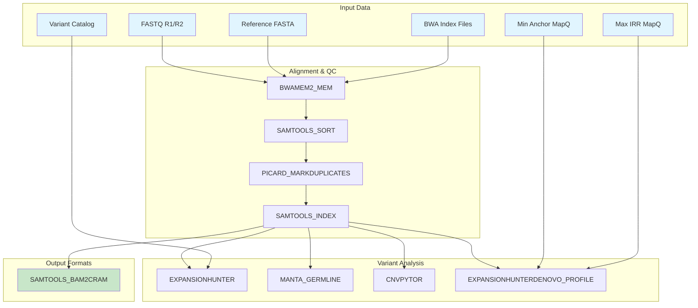

# nl-wgs_wf

A comprehensive Nextflow pipeline for whole genome sequencing (WGS) analysis of germline short-read data. This pipeline is inspired by the [rare diseases pipeline from nf-core](https://nf-co.re/raredisease).

## Overview

This pipeline performs end-to-end analysis of whole genome sequencing data, including alignment, variant calling, structural variant detection, and repeat expansion analysis. It's designed for germline samples and supports both local and cloud execution.

## Features

- **BWA-MEM2 Alignment**: Fast and accurate read alignment
- **Quality Control**: BAM sorting, indexing, and duplicate marking
- **Variant Calling**: SNV/indel detection with DeepVariant
- **Structural Variants**: Detection with Manta
- **Copy Number Variants**: Analysis with CNVpytor
- **Repeat Expansions**: Detection with ExpansionHunter and ExpansionHunterDenovo
- **Format Conversion**: BAM to CRAM conversion for storage efficiency
- **Container Support**: Docker/Singularity containers for reproducibility
- **Cloud Ready**: S3 support for input/output files

## Architecture



## Quick Start

### Prerequisites

- Nextflow 22.04.0 or later
- Docker or Singularity
- AWS credentials (for S3 access)

### Basic Usage

```bash
nextflow run main.nf \
    --sample_name "Sample_001" \
    --fastq_r1 "path/to/sample_R1.fastq.gz" \
    --fastq_r2 "path/to/sample_R2.fastq.gz" \
    --fasta "path/to/reference.fasta" \
    --fai "path/to/reference.fasta.fai" \
    --variant_catalog "path/to/variant_catalog.json" \
    --min_anchor_mapq 50 \
    --max_irr_mapq 40
```

## Input Parameters

### Required Parameters

| Parameter | Description | Example |
|-----------|-------------|---------|
| `--fastq_r1` | Forward reads FASTQ file | `sample_R1.fastq.gz` |
| `--fastq_r2` | Reverse reads FASTQ file | `sample_R2.fastq.gz` |
| `--fasta` | Reference genome FASTA | `hg38.fa` |
| `--fai` | FASTA index file | `hg38.fa.fai` |

### Optional Parameters

| Parameter | Description | Default |
|-----------|-------------|---------|
| `--sample_name` | Sample identifier | File basename |
| `--variant_catalog` | ExpansionHunter variant catalog | `null` |
| `--min_anchor_mapq` | Min anchor mapping quality | `null` |
| `--max_irr_mapq` | Max IRR mapping quality | `null` |
| `--outdir` | Output directory | `/mnt/workflow/pubdir` |

## Output Structure

```
outdir/
├── hg38/
│   ├── ALIGNMENT/
│   │   ├── *.sorted.bam
│   │   ├── *.MarkDuplicates.bam
│   │   └── *.cram
│   ├── BWA_SAMTOOLS/
│   │   └── *.bam
│   ├── SNV/
│   │   ├── *.deepvariant.vcf.gz
│   │   └── *.deepvariant.gvcf.gz
│   ├── SV/
│   │   ├── *.candidate_sv.vcf.gz
│   │   └── *.diploid_sv.vcf.gz
│   └── REPEATS/
│       ├── *.vcf.gz
│       ├── *.json.gz
│       └── *.locus.tsv
```

## Processes

### Core Alignment
- **BWAMEM2_MEM**: BWA-MEM2 alignment with read group information
- **SAMTOOLS_SORT**: BAM file sorting and indexing
- **PICARD_MARKDUPLICATES**: Duplicate marking and removal
- **SAMTOOLS_INDEX**: BAM indexing for downstream tools

### Variant Analysis
- **DEEPVARIANT_RUNDEEPVARIANT**: SNV/indel calling (commented out)
- **MANTA_GERMLINE**: Structural variant detection
- **CNVPYTOR**: Copy number variant analysis
- **EXPANSIONHUNTER**: Repeat expansion detection
- **EXPANSIONHUNTERDENOVO_PROFILE**: De novo repeat detection

### Format Conversion
- **SAMTOOLS_BAM2CRAM**: BAM to CRAM conversion

## Configuration

### Docker Images

The pipeline uses the following Docker images (configure in `nextflow.config`):

- `bwa_docker`: BWA-MEM2 and Samtools
- `picard_docker`: Picard tools
- `deepvariant_docker`: DeepVariant
- `manta_docker`: Manta
- `expansionhunter_docker`: ExpansionHunter
- `expansionhunterdenovo_docker`: ExpansionHunterDenovo

### Resource Requirements

| Process | Memory | CPUs |
|---------|--------|------|
| BWAMEM2_MEM | 32 GB | 16 |
| SAMTOOLS_SORT | 16 GB | 8 |
| PICARD_MARKDUPLICATES | 32 GB | 16 |
| MANTA_GERMLINE | 32 GB | 16 |
| EXPANSIONHUNTER | 32 GB | 16 |
| CNVPYTOR | 16 GB | 8 |

## Dependencies

### BWA Index Files

The pipeline requires BWA-MEM2 index files for the reference genome:

```bash
# Generate BWA-MEM2 index
bwa-mem2 index /path/to/reference.fasta
```

This creates:
- `reference.fasta.0123` (binary sequence file)
- `reference.fasta.amb` (amb file)
- `reference.fasta.ann` (ann file)
- `reference.fasta.bwt.2bit.64` (bwt file)
- `reference.fasta.pac` (pac file)

## Troubleshooting

### Common Issues

1. **Missing BWA Index Files**
   ```
   Error: Missing required BWA index file: reference.fasta.amb
   ```
   **Solution**: Generate BWA-MEM2 index files using `bwa-mem2 index`

2. **S3 Access Issues**
   ```
   Cannot find any reads matching: s3://bucket/file.fastq.gz
   ```
   **Solution**: Ensure AWS credentials are configured and S3 permissions are set

3. **Memory Issues**
   ```
   samtools sort: couldn't allocate memory for bam_mem
   ```
   **Solution**: Increase memory allocation in `nextflow.config`

### Log Files

Check the `.nextflow.log` file for detailed execution logs and error messages.

## Citation

If you use this pipeline in your research, please cite:

- Nextflow: Di Tommaso, P. et al. (2017). Nextflow enables reproducible computational workflows. Nature Biotechnology, 35(4), 316-319.
- BWA-MEM2: Vasimuddin, M. et al. (2019). Efficient architecture-aware acceleration of BWA-MEM for multicore systems. IEEE IPDPS.
- DeepVariant: Poplin, R. et al. (2018). A universal SNP and small-indel variant caller using deep neural networks. Nature Biotechnology, 36(10), 983-987.

## License

This project is licensed under the MIT License - see the [LICENSE](LICENSE) file for details.

## Contributing

1. Fork the repository
2. Create a feature branch
3. Make your changes
4. Add tests if applicable
5. Submit a pull request

## Support

For questions and support, please open an issue on the GitHub repository.
