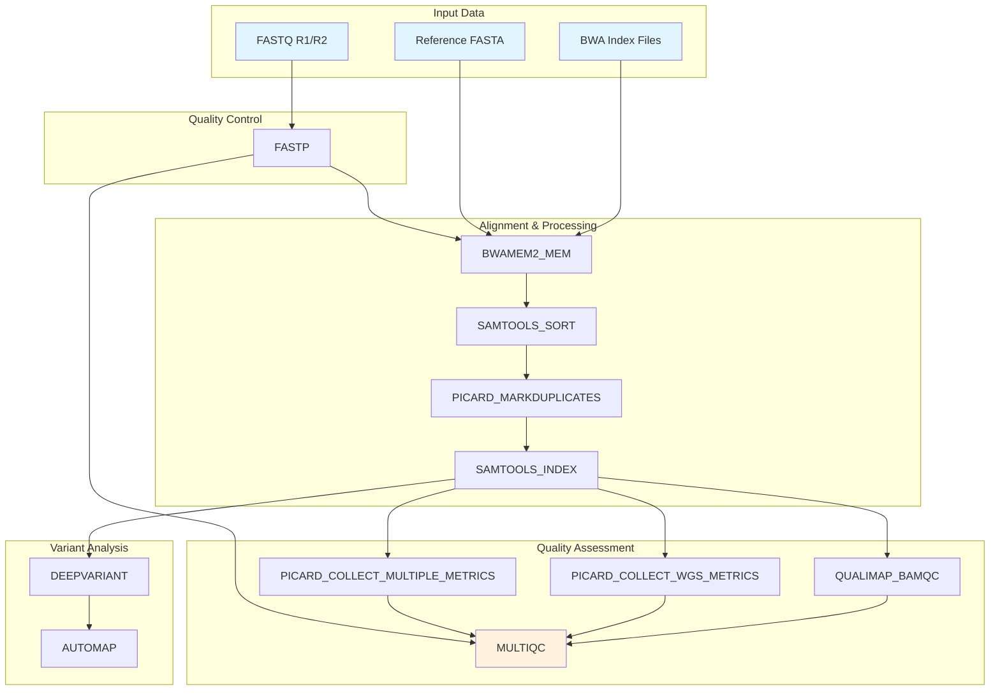

# nl-wgs_wf

[](https://www.nextflow.io/)
[](https://www.docker.com/)
[](https://opensource.org/licenses/MIT)

A comprehensive Nextflow pipeline for whole genome sequencing (WGS) analysis of germline short-read data. This pipeline is inspired by the [rare diseases pipeline from nf-core](https://nf-co.re/raredisease).

**Version**: 1.0.0-HPC  
**Branch**: hpc  
**Last Updated**: January 2025

## 🎉 HPC-Optimized Version

This is the **HPC branch** of the nl-wgs_wf pipeline, specifically optimized for High Performance Computing environments. This version includes:

- ✅ **HPC-Optimized Resource Allocation**: Reduced memory and CPU requirements for cluster environments
- ✅ **Local Docker Registry**: Uses specific ECR registry for container images
- ✅ **Streamlined Workflow**: Focused on core analysis components
- ✅ **Test Data Integration**: Includes sample data paths for testing
- ✅ **Cluster-Friendly Configuration**: Optimized for SLURM, PBS, and other HPC schedulers

## Overview

This pipeline performs end-to-end analysis of whole genome sequencing data, including quality control, alignment, and variant calling. It's designed for germline samples and optimized for HPC cluster environments.

## Features

- **FASTP Quality Control**: Adapter trimming, quality filtering, and QC reports
- **BWA-MEM2 Alignment**: Fast and accurate read alignment
- **BAM Processing**: Sorting, indexing, duplicate marking, and format conversion
- **Quality Assessment**: MultiQC report aggregation, Qualimap BAM QC, Picard metrics
- **Variant Calling**: SNV/indel detection with DeepVariant
- **Variant Annotation**: AutoMap integration for variant annotation
- **HPC Optimization**: Reduced resource requirements for cluster environments
- **Local Container Registry**: ECR-based Docker images for faster access
- **Test Data Ready**: Pre-configured with sample data paths
- **Cluster Compatible**: Optimized for HPC schedulers (SLURM, PBS, etc.)

## Architecture



## Quick Start

### Prerequisites

- Nextflow 22.04.0 or later
- Docker or Singularity
- HPC cluster access (SLURM, PBS, or similar)
- Access to ECR registry: `224597534425.dkr.ecr.us-west-2.amazonaws.com`

### HPC Usage

The HPC version comes pre-configured with test data and optimized resource settings:

```bash
# Run with default test data (NA12878 sample)
nextflow run main.nf

# Run with custom data
nextflow run main.nf \
    --sample_name "Your_Sample" \
    --fastq_r1 "path/to/sample_R1.fastq.gz" \
    --fastq_r2 "path/to/sample_R2.fastq.gz" \
    --fasta "path/to/reference.fasta" \
    --fai "path/to/reference.fasta.fai"
```

### Test Data

The pipeline includes pre-configured test data paths:
- **Sample**: NA12878
- **FASTQ**: ERR3239334 paired-end reads
- **Reference**: hg38 with BWA-MEM2 index files
- **Output**: `results/` directory

## Input Parameters

### Required Parameters

| Parameter | Description | Example | Default (HPC) |
|-----------|-------------|---------|---------------|
| `--fastq_r1` | Forward reads FASTQ file | `sample_R1.fastq.gz` | `ERR3239334_1.1600k.fastq.gz` |
| `--fastq_r2` | Reverse reads FASTQ file | `sample_R2.fastq.gz` | `ERR3239334_2.1600k.fastq.gz` |
| `--fasta` | Reference genome FASTA | `hg38.fa` | `hg38.fa` |
| `--fai` | FASTA index file | `hg38.fa.fai` | `hg38.fa.fai` |

### Optional Parameters

| Parameter | Description | Default (HPC) |
|-----------|-------------|---------------|
| `--sample_name` | Sample identifier | `NA12878` |
| `--outdir` | Output directory | `results` |
| `--genome` | Genome build | `hg38` |

## Output Structure

```
results/
├── hg38/
│   ├── QC/                                    # Quality Control Reports
│   │   ├── *_fastp.html                      # FASTP HTML report
│   │   ├── *_fastp.json                      # FASTP JSON metrics
│   │   ├── *_multiqc_report.html             # MultiQC aggregated report
│   │   ├── *_multiqc_data/                   # MultiQC data files
│   │   ├── *.metrics                         # Picard multiple metrics
│   │   ├── *.wgs_metrics                     # Picard WGS metrics
│   │   └── *_bamqc/                          # Qualimap BAM QC results
│   ├── ALIGNMENT/                            # Alignment Files
│   │   ├── *.sorted.bam                      # Sorted BAM files
│   │   ├── *.MarkDuplicates.bam              # Duplicate-marked BAM files
│   │   ├── *.bam.bai                         # BAM index files
│   │   └── *.yml                             # Process version files
│   ├── SNV/                                  # Single Nucleotide Variants
│   │   ├── *.deepvariant.vcf.gz              # DeepVariant VCF output
│   │   ├── *.deepvariant.vcf.gz.tbi          # VCF index files
│   │   ├── *.deepvariant.gvcf.gz             # DeepVariant gVCF output
│   │   ├── *.deepvariant.gvcf.gz.tbi         # gVCF index files
│   │   └── *.yml                             # Process version files
│   └── ROH/                                  # Runs of Homozygosity
│       ├── */*.HomRegions.tsv                # AutoMap homozygosity regions
│       ├── */*.HomRegions.pdf                # AutoMap homozygosity plots
│       └── *.yml                             # Process version files
```

## Processes

### Quality Control
- **FASTP**: Adapter trimming, quality filtering, and QC reports

### Core Alignment
- **BWAMEM2_MEM**: BWA-MEM2 alignment with read group information
- **SAMTOOLS_SORT**: BAM file sorting and indexing
- **PICARD_MARKDUPLICATES**: Duplicate marking and removal
- **SAMTOOLS_INDEX**: BAM indexing for downstream tools

### Quality Assessment
- **PICARD_COLLECT_MULTIPLE_METRICS**: Comprehensive BAM metrics collection
- **PICARD_COLLECT_WGS_METRICS**: Whole genome sequencing metrics
- **QUALIMAP_BAMQC**: BAM quality control analysis
- **MULTIQC**: QC report aggregation from all tools

### Variant Analysis
- **DEEPVARIANT_RUNDEEPVARIANT**: SNV/indel calling with DeepVariant
- **AUTOMAP**: Variant annotation and runs of homozygosity detection

## Configuration

### Docker Images

The pipeline uses the following Docker images from ECR registry (configure in `nextflow.config`):

- `fastp_docker`: FASTP quality control
- `bwa_docker`: BWA-MEM2 and Samtools
- `picard_docker`: Picard tools
- `qualimap_docker`: Qualimap BAM QC
- `multiqc_docker`: MultiQC report generation
- `deepvariant_docker`: DeepVariant
- `automap_docker`: AutoMap variant annotation

### Resource Requirements (HPC Optimized)

| Process | Memory | CPUs |
|---------|--------|------|
| FASTP | 16 GB | 8 |
| BWAMEM2_MEM | 32 GB | 16 |
| SAMTOOLS_SORT | 16 GB | 8 |
| PICARD_MARKDUPLICATES | 32 GB | 16 |
| PICARD_COLLECT_MULTIPLE_METRICS | 16 GB | 8 |
| PICARD_COLLECT_WGS_METRICS | 16 GB | 8 |
| QUALIMAP_BAMQC | 16 GB | 8 |
| MULTIQC | 4 GB | 4 |
| DEEPVARIANT_RUNDEEPVARIANT | 32 GB | 16 |
| AUTOMAP | 16 GB | 8 |

## Dependencies

### BWA Index Files

The pipeline requires BWA-MEM2 index files for the reference genome:

```bash
# Generate BWA-MEM2 index
bwa-mem2 index /path/to/reference.fasta
```

This creates:
- `reference.fasta.0123` (binary sequence file)
- `reference.fasta.amb` (amb file)
- `reference.fasta.ann` (ann file)
- `reference.fasta.bwt.2bit.64` (bwt file)
- `reference.fasta.pac` (pac file)

## Troubleshooting

### Common Issues

1. **Missing BWA Index Files**
   ```
   Error: Missing required BWA index file: reference.fasta.amb
   ```
   **Solution**: Generate BWA-MEM2 index files using `bwa-mem2 index`

2. **S3 Access Issues**
   ```
   Cannot find any reads matching: s3://bucket/file.fastq.gz
   ```
   **Solution**: Ensure AWS credentials are configured and S3 permissions are set

3. **Memory Issues**
   ```
   samtools sort: couldn't allocate memory for bam_mem
   ```
   **Solution**: Increase memory allocation in `nextflow.config`

### Log Files

Check the `.nextflow.log` file for detailed execution logs and error messages.

## Citation

If you use this pipeline in your research, please cite:

- Nextflow: Di Tommaso, P. et al. (2017). Nextflow enables reproducible computational workflows. Nature Biotechnology, 35(4), 316-319.
- BWA-MEM2: Vasimuddin, M. et al. (2019). Efficient architecture-aware acceleration of BWA-MEM for multicore systems. IEEE IPDPS.
- DeepVariant: Poplin, R. et al. (2018). A universal SNP and small-indel variant caller using deep neural networks. Nature Biotechnology, 36(10), 983-987.

## License

This project is licensed under the MIT License - see the [LICENSE](LICENSE) file for details.

## Contributing

1. Fork the repository
2. Create a feature branch
3. Make your changes
4. Add tests if applicable
5. Submit a pull request

## Support

For questions and support, please open an issue on the GitHub repository.
